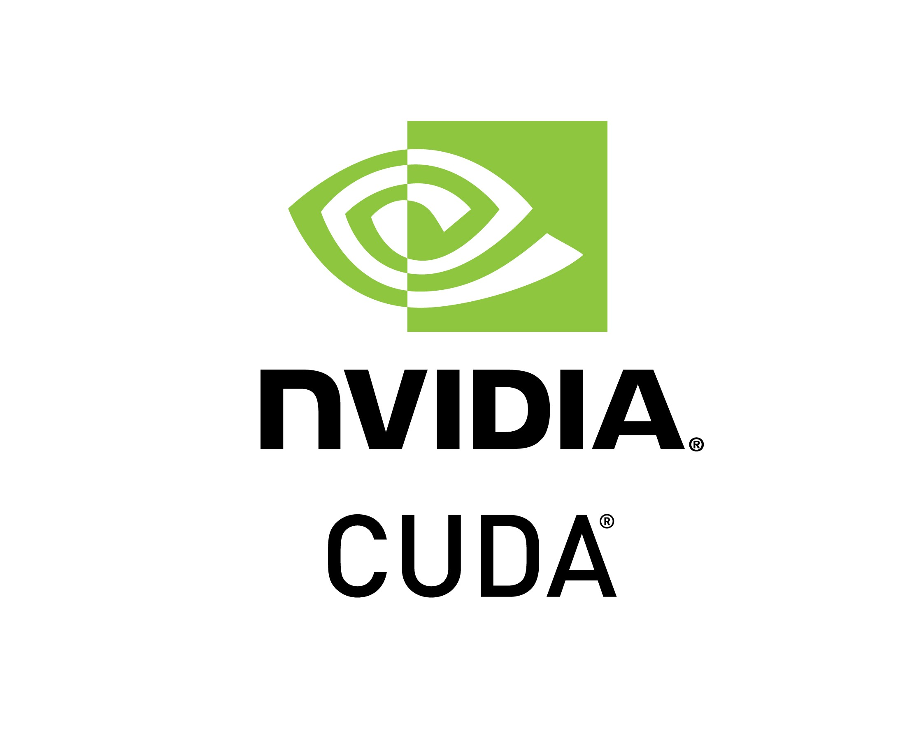
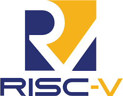
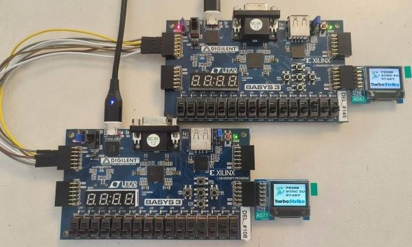

# 🚀 Projects

Below is a list of some of my key projects:

---

### Project 1: Parallel Virus Scanning with CUDA

  
  

    
Developed a CUDA-based parallel program to detect viral DNA in human samples, achieving significant performance gains on NVIDIA A100 and H100 GPUs.

    
Optimized DNA sequence matching with asynchronous kernel launches and memory transfers, ensuring scalability and efficiency under strict resource constraints.

  

---

### Project 2: High-Performance RISC-V Processor Design

  
  

    
Designed a pipelined RISC-V CPU in Verilog and integrated the Karatsuba Algorithm to optimize matrix multiplication, achieving significant performance improvements.

    
Implemented dynamic branch prediction with a Branch History Table and developed hazard detection and forwarding mechanisms to ensure seamless pipeline execution.

  

---

### Project 3: Simulation of MRT Network using MPI

  
  

    
Simulated a rapid transit network system using MPI for distributed memory parallelization.

    
Implemented synchronization mechanisms to manage train spawning, station queuing, and link utilization efficiently under realistic constraints.

  

---

### Project 4: AI-Powered Crowd Density Management for NUS Campus

  
  

    
Developed and trained ML models for campus crowd density classification, using various techniques to enhance accuracy and efficiency.

    
Collected and preprocessed actual crowd images from the NUS campus for training and evaluation.

  

---

### Project 5: RTOS-based Robotic Car

  
  

    
Developed a RTOS-based robotic car to perform required concurrent tasks and created a RTOS rover which can juggle multiple threads with synchronization methods.

    
Deployed RTX RTOS on ARM-Cortex M KL25Z board and wrote driver for different threads.

  

---

### Project 6: FPGA Soccer Arena

  
  

    
Developed a two-player soccer game in FPGA using Verilog, incorporating smooth animations and user interactions to enhance the gaming experience.

    
Optimized the game with a self-implemented gravity engine and communication encoder-decoder for seamless player synchronization.

  

